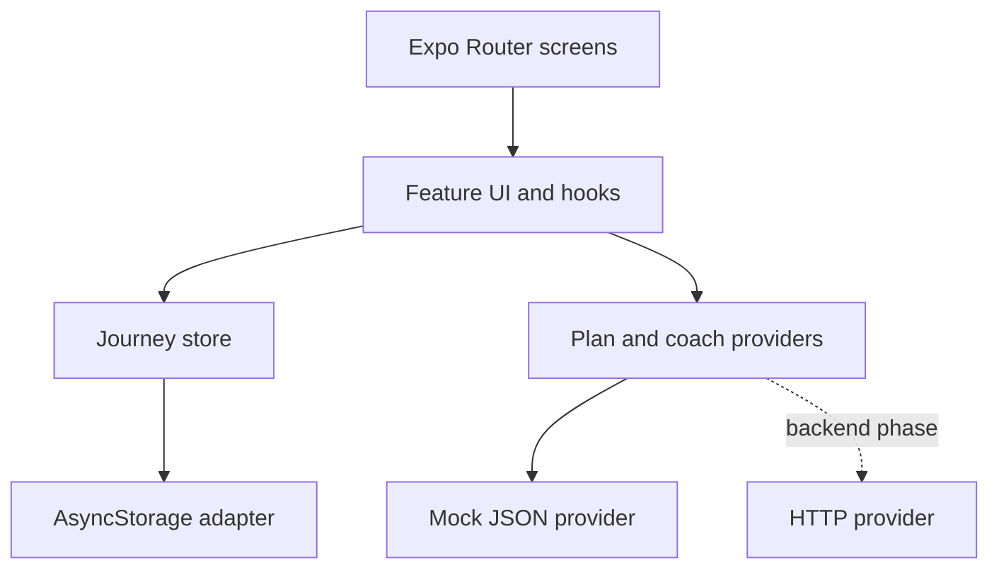

# SkillPilot AI — MVP Architecture Brief

## Product boundary

SkillPilot answers one question: **“What should I learn next to reach my hobby goal?”** The MVP creates a focused 5–8 technique plan, mixes media with practice, lets the learner complete, skip, or replace a technique, and makes overall progress obvious.

The original design board is consolidated into exactly nine primary screens:

1. **Create Goal** — hobby, outcome, level, and daily time in one guided form.
2. **AI Plan Generation** — transparent generation steps plus a useful retry state.
3. **Dashboard** — next best action, today’s mission, streak, and journey progress.
4. **Learning Plan** — ordered 5–8 technique roadmap.
5. **Technique Detail** — overview plus context-appropriate video, audio, or reading resources.
6. **Practice** — focused timer, checklist, reflection, and completion.
7. **AI Coach** — contextual explain/simplify/replace assistance, not a generic chatbot.
8. **Progress** — weekly insight, completed/skipped techniques, and achievements.
9. **Profile** — goal summary and reset/export actions only.

Splash is native launch branding. Today’s plan, lesson replacement, notes, achievement detail, and confirmation states are sections, sheets, or dialogs—not extra screens. Signup, social/community, leaderboard, subscription, notifications, voice/camera coaching, and settings are intentionally excluded.

## Technical shape



- **Runtime:** Expo SDK 57, React Native 0.86, React 19.2, TypeScript strict mode, Hermes/New Architecture.
- **Navigation:** Expo Router for Android, iOS, and responsive web from one route tree.
- **State:** one small persisted journey store; transient form/sheet state remains local. TanStack Query is deferred until the backend creates real server state.
- **Data boundary:** UI depends on `PlanRepository` and `AIPlanProvider` interfaces. The frontend starts with validated JSON and `MockAIProvider`; the later HTTP implementations replace them without changing screens.
- **Persistence:** AsyncStorage keeps onboarding, statuses, notes, streak, and progress after restart. No authentication is needed for the assignment MVP.
- **UI:** React Native `StyleSheet`, design tokens, reusable primitives, platform-aware sheets/modals, responsive max-width layouts, and built-in animations. Heavy packages are added only for measured needs.

```text
src/
  app/                 routes and layouts only
  features/            onboarding, plan, practice, coach, progress, profile
  components/          reusable product and UI primitives
  data/                 versioned dummy JSON
  services/             repository, AI provider, storage adapters
  store/                persisted journey state and selectors
  theme/                colors, spacing, typography, shadows
  types/                domain contracts
  utils/                pure calculations and validation
```

## Backend-ready AI plan

Frontend phase uses deterministic dummy JSON so UI work is testable and independent of network quotas. Backend phase adds a small Fastify/TypeScript API with `POST /v1/plans/generate` and `POST /v1/coach/respond`. The API key remains server-side, AI output is constrained to a JSON schema, and invalid output is retried or replaced by a safe fallback plan.

Initial model candidate: **Gemini 2.5 Flash-Lite**, because Google currently lists free-tier input/output and positions it for cost-efficient, at-scale usage. Quotas are rechecked immediately before submission because provider limits can change.

## Quality gates

- Unit tests: progress calculation, technique transitions, validation, and repository mapping.
- Component tests: Create Goal, complete/skip/replace, persistence recovery, and empty/error states.
- E2E smoke flow: create goal → generate plan → practice → complete → verify progress.
- CI: format, ESLint, TypeScript, Jest, and Expo web export; Android preview/APK after the UI stabilizes.

## Research references

- [Expo SDK 57 / React Native 0.86](https://expo.dev/changelog/sdk-57)
- [Expo Router for universal React Native apps](https://docs.expo.dev/router/introduction/)
- [React Native Hermes](https://reactnative.dev/docs/hermes)
- [Expo unit testing with Jest](https://docs.expo.dev/develop/unit-testing/)
- [Gemini API pricing](https://ai.google.dev/gemini-api/docs/pricing)
- [Gemini API rate limits](https://ai.google.dev/gemini-api/docs/rate-limits)

