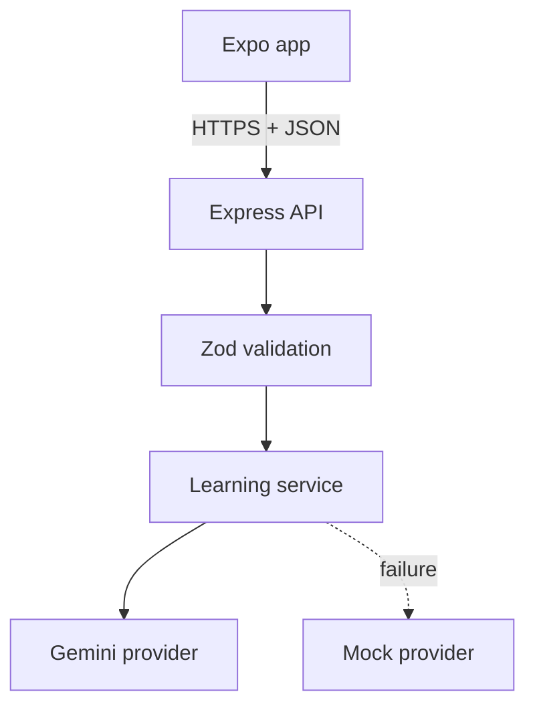

# SkillPilot API — Backend Architecture

## Decision summary

The backend is a separate Node.js project under `backend/` and deploys as one stateless Express application on Vercel. The Expo application and API share a repository but not runtime dependencies. This keeps the mobile bundle small, prevents server secrets from entering the APK, and lets Vercel deploy only the backend directory.

Vercel officially supports Express with zero configuration. Its Hobby plan is free for personal/non-commercial projects and currently includes the first 1,000,000 function invocations. That is appropriate for an assignment demo, but not a promise of permanently free commercial hosting.



## Project boundary

```text
backend/
  src/
    __tests__/       HTTP and fallback tests
    data/            curated hobby blueprints
    domain/          AI-output normalization
    providers/       mock and Gemini adapters
    services/        provider orchestration
    app.ts            Express composition and routes
    contracts.ts      Zod request/domain schemas
    index.ts          Vercel entry point
    server.ts         local and Vercel Node server entry
  .env.example
  package.json
  tsconfig.json
  vercel.json
```

The API deliberately has no database or authentication in the assignment MVP. Journey progress, notes, and practice sessions are device-owned state in AsyncStorage. The backend performs only operations that need a trusted server: protecting the AI key, validating prompts, generating structured plans, and applying safe fallback behavior.

## API surface

| Method | Route | Responsibility |
|---|---|---|
| `GET` | `/api/v1/health` | Deployment and provider health |
| `GET` | `/api/v1/hobbies` | Lightweight prepared catalog metadata |
| `POST` | `/api/v1/plans/generate` | Create a validated 5–8 technique plan |
| `POST` | `/api/v1/techniques/replace` | Replace one technique while preserving identity/order |
| `POST` | `/api/v1/coach/respond` | Return one contextual cue and next action |

Successful mutations return:

```json
{
  "data": {},
  "meta": {
    "requestId": "request-id",
    "provider": "gemini",
    "fallbackUsed": false
  }
}
```

Errors use one stable envelope with `code`, `message`, `requestId`, and validation details when safe. The `x-request-id` response header makes a failed mobile request traceable in Vercel logs.

## AI boundary

`LearningProvider` is the only model-facing interface. `GeminiLearningProvider` uses the current Interactions API with `store: false` and structured JSON output. Both the generated JSON and its business semantics are checked before they reach the app:

- exactly 5–8 techniques;
- 1–4 appropriate resources per technique;
- 2–5 practice tasks and key points;
- daily-time limits applied server-side;
- deterministic IDs and dependency order;
- first technique `in_progress`, remaining techniques `locked`;
- accidental audio resources converted to reading for non-audio MVP hobbies.

If Gemini times out, exceeds quota, or returns invalid content, `LearningService` repeats the same operation with `MockLearningProvider`. The response tells the client that fallback was used. This makes the demo reliable without hiding the production behavior.

## Security and operational choices

- `GEMINI_API_KEY` exists only in Vercel environment variables.
- Request bodies are capped at 32 KB and validated before use.
- Coach prompts are capped at 600 characters.
- CORS can be restricted with `ALLOWED_ORIGINS`; native clients without a browser origin remain supported.
- AI requests time out before Vercel's function ceiling.
- The API never logs request bodies, goals, or model keys.
- Responses are `no-store`; provider calls are stateless.
- No in-memory persistence or pretend rate limiter is used because Vercel instances are ephemeral. Distributed rate limiting can be added only when real public traffic warrants it.

## Free deployment

1. Import `omkarborude/skillpilot-ai` into Vercel.
2. Set **Root Directory** to `backend`.
3. Keep the detected Node/Express settings; `src/index.ts` exports the Express app.
4. Add `AI_PROVIDER=gemini`, `GEMINI_API_KEY`, `GEMINI_MODEL=gemini-3.5-flash-lite`, and the web origin in `ALLOWED_ORIGINS`.
5. Deploy and call `/api/v1/health`.
6. Put the resulting URL in the Expo build as `EXPO_PUBLIC_API_URL`.

For a quota-independent demo, deploy with `AI_PROVIDER=mock`; no Gemini key is then required.

## Research references

- [Express on Vercel](https://vercel.com/docs/frameworks/backend/express)
- [Vercel Hobby plan](https://vercel.com/docs/plans/hobby)
- [Vercel Node.js runtime](https://vercel.com/docs/functions/runtimes/node-js)
- [Gemini structured outputs](https://ai.google.dev/gemini-api/docs/structured-output)
- [Gemini API pricing](https://ai.google.dev/gemini-api/docs/pricing)
- [Gemini API rate limits](https://ai.google.dev/gemini-api/docs/rate-limits)
