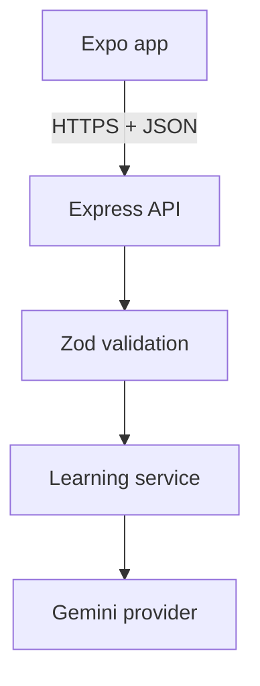

# SkillPilot API — Backend Architecture

## Decision summary

The backend is a separate Node.js project under `backend/` and runs as one stateless Express application. The Expo application and API share a repository but not runtime dependencies. The deployed client points to the Render service at `https://skillpilot-api.onrender.com`.



## Project boundary

```text
backend/
  src/
    __tests__/       HTTP, provider, and failure tests
    domain/          AI-output normalization
    providers/       Gemini adapter and test fixture provider
    services/        provider orchestration
    app.ts            Express composition and routes
    contracts.ts      Zod request/domain schemas
    index.ts          Express application composition
    server.ts         Node server entry
  .env.example
  package.json
  tsconfig.json
```

The API deliberately has no database. Journey progress, conversation history, and practice sessions are device-owned state in IndexedDB on web and AsyncStorage on native. The backend performs only operations that need a trusted server: protecting the Gemini key, validating prompts, and generating structured learning content.

## API surface

| Method | Route | Responsibility |
|---|---|---|
| `GET` | `/api/v1/health` | Deployment and provider health |
| `POST` | `/api/v1/plans/generate` | Create a validated 5–8 technique plan |
| `POST` | `/api/v1/techniques/replace` | Replace one technique while preserving identity/order |
| `POST` | `/api/v1/coach/respond` | Return one contextual cue and next action |

Successful mutations return:

```json
{
  "data": {},
  "meta": {
    "requestId": "request-id",
    "provider": "gemini",
    "fallbackUsed": false
  }
}
```

Errors use one stable envelope with `code`, `message`, `requestId`, and validation details when safe. The `x-request-id` response header helps correlate a failed client request with backend logs.

## AI boundary

`LearningProvider` is the only model-facing interface. `GeminiLearningProvider` uses the current Interactions API with `store: false` and structured JSON output. Both the generated JSON and its business semantics are checked before they reach the app:

- exactly 5–8 techniques;
- 1–4 resource recommendations per technique;
- 2–5 practice tasks and key points;
- daily-time limits applied server-side;
- deterministic IDs and dependency order;
- first technique `in_progress`, remaining techniques `locked`;
- accidental audio recommendations converted to an explicit article search for hobbies where audio is inappropriate.

For external resources, the structured contract accepts only a media type, search query, and description. It does not accept a model-generated source URL, title, or duration. Guided practice records open the app's timer and checklist. Google Search grounding can return citation metadata, but it is not enabled in this implementation and was not live-verified here, so the API returns honest search recommendations rather than claiming verified sources.

If Gemini times out, exceeds quota, or returns invalid content, `LearningService` propagates the provider error. The API logs it with a request ID and returns a stable error envelope. The client preserves the learner's input and offers retry without replacing the response with fabricated content.

## Security and operational choices

- `GEMINI_API_KEY` is read only by the backend process and is never placed in an `EXPO_PUBLIC_` variable.
- Request bodies are capped at 32 KB and validated before use.
- Coach prompts are capped at 600 characters.
- CORS can be restricted with `ALLOWED_ORIGINS`; native clients without a browser origin remain supported.
- AI requests use explicit timeouts.
- The API never logs request bodies, goals, or model keys.
- Responses are `no-store`; provider calls are stateless.
- No in-memory persistence or rate limiter is implemented.

## Render deployment

1. Create a Render Web Service from the repository and set **Root Directory** to `backend`.
2. Use `npm ci && npm run compile` as the build command and `npm start` as the start command.
3. Add `AI_PROVIDER=gemini`, `GEMINI_API_KEY`, `GEMINI_MODEL`, and `ALLOWED_ORIGINS` as service environment variables. Render supplies `PORT`.
4. Deploy and verify `GET /api/v1/health`.
5. Set the Expo build's `EXPO_PUBLIC_API_URL` to the service URL.

## Research references

- [Render Node.js deployment](https://render.com/docs/deploy-node-express-app)
- [Gemini structured outputs](https://ai.google.dev/gemini-api/docs/structured-output)
- [Gemini grounding with Google Search](https://ai.google.dev/gemini-api/docs/google-search)
- [Gemini API pricing](https://ai.google.dev/gemini-api/docs/pricing)
- [Gemini API rate limits](https://ai.google.dev/gemini-api/docs/rate-limits)
